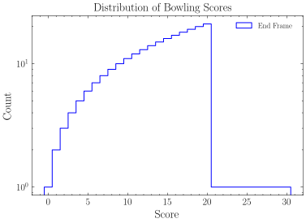
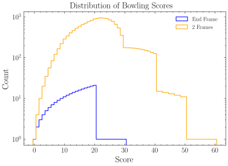
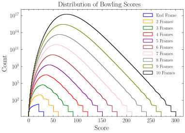
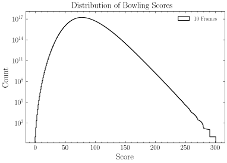

---
format:
  hugo-md:
    code-fold: false
parent: null
title: Bowling Is Finite
deck: How many bowling games are there, and what are their scores like?
date: '2026-06-15T00:00:00+02:00'
tags: []
execute:
  echo: true
  freeze: auto
jupyter: python3
---


I happened upon a curious thought the other day that, at first glance, seems fairly unassuming: *there are finitely many bowling games*.

```goat {height=100, style="font-style: normal; font-family: monospace; font-size: 0.75em !important;"}
.-.-.-.-.-.-.-.-.-.-.-.-.-.-.-.-.-.-.-.-.-.-.-.-.-.-.-.-.-.-.-.
| |8|–| |5|4| |X| | |9|∕| |5|4| |3|5| |X| | |8|∕| |9|–| |6|–| |
| .-.-. .-.-. .-.-. .-.-. .-.-. .-.-. .-.-. .-.-. .-.-. .-.-.-.
|    8|   17|   37|   52|   61|   69|   89|  108|  117|    123|
.-----.-----.-----.-----.-----.-----.-----.-----.-----.-------.
```
<p class="diagram-caption">Example bowling game I played from 2016.</p>

Of course, the bowling lane's setup and the ball/pin trajectories introduce continua that otherwise make this counting problem ill-defined.
But in terms of *score*, a normal strike and a Brooklyn strike have no distinction in the progression of the game---a strike is a strike.
In this sense, two games of identical scoring sequences are effectively the same bowling game.
This is the finite set, for there are surely finitely many scoring sequences over a 10-frame game.

This is true for more than just bowling, of course.
Many sports and games use discrete scoring systems, hinting at lurking counting problems.
However, bowling boasts a few niceties that make it more mathematically interesting than other candidates.
First, bowling doesn't require symmetric scoring between two opponents; it can be played alone (in contrast to tennis, basketball, football, etc.).
Second, bowling is strictly finite without accounting for human factors (e.g., deuces in tennis and table tennis, no-balls in cricket, or simply missing shots in golf, darts, or pool all add pesky improbable infinites).
Third, bowling's scoring system is weird.

### The Scoring System

In standard 10-pin bowling, a game lasts for **10 frames**.
Each frame provides 2 opportunities to knock down as many pins as possible.

Knocking down fewer than 10 pins in a frame is called an **open** frame.
The points earned in an open frame are simply how many pins were knocked down.

```goat {height=100, style="font-style: normal; font-family: monospace; font-size: 0.75em !important;"}
.-.-.-.-.-.-.
| |5|1| |7|2|
| .-.-. .-.-.
|    6|   15|
.-----.-----.
```
<p class="diagram-caption">Frame 1 adds 6 points. Frame 2 adds 9 for a total of 15.</p>

Knocking down all 10 pins with exactly 2 shots in a frame is called a **spare**.
A spare acquires points from the next shot into its frame.

```goat {height=100, style="font-style: normal; font-family: monospace; font-size: 0.75em !important;"}
.-.-.-.-.-.-.
| |9|∕| |7|2|
| .-.-. .-.-.
|   17|   26|
.-----.-----.
```
<p class="diagram-caption">Frame 1 adds 17 points (taking 7 from the next frame). Frame 2 adds 9 for a total of 26.</p>

Knocking down all 10 pins with exactly 1 shot in a frame is called a **strike**.
A strike acquires points from the next two shots into its frame.

```goat {height=100, style="font-style: normal; font-family: monospace; font-size: 0.75em !important;"}
.-.-.-.-.-.-.
| |X| | |7|2|
| .-.-. .-.-.
|   19|   28|
.-----.-----.
```
<p class="diagram-caption">Frame 1 adds 19 points (taking 7+2 from the next frame). Frame 2 adds 9 for a total of 28.</p>

Note that bonuses are added from the next **shots**, which may extend beyond the next frame.
A strike frame followed by two strikes contributes a whopping 30 points, whereas a spare frame followed by a strike can contribute a maximum of 20.
Chaining strikes is incredibly rewarding.
A perfect game comprising 12 consecutive strikes reaches a total of 300 points.

```goat {height=100, style="font-style: normal; font-family: monospace; font-size: 0.75em !important;"}
.-.-.-.-.-.-.-.-.-.-.-.-.-.-.-.-.-.-.-.-.-.-.-.-.-.-.-.-.-.-.-.
| |X| | |X| | |X| | |X| | |X| | |X| | |X| | |X| | |X| | |X|X|X|
| .-.-. .-.-. .-.-. .-.-. .-.-. .-.-. .-.-. .-.-. .-.-. .-.-.-.
|   30|   60|   90|  120|  150|  180|  210|  240|  270|    300|
.-----.-----.-----.-----.-----.-----.-----.-----.-----.-------.
```
<p class="diagram-caption">A perfect game knocks down 120 pins and scores 300 points.</p>

You may have noticed the curious 10th frame with 3 strikes in it.
In standard 10-pin bowling, the 10th frame functions slightly differently from the rest. Here is its case-by-case behavior:
- Open frame: the same as any other frame.
- Spare: unlocks 1 extra shot, but no bonuses are added for this frame.
- Strike: unlocks 2 extra shots, but no bonuses are added for this frame.

This makes it possible to get 3 strikes in the final frame, or strike out.{}Strictly speaking, "striking out" refers to getting consecutive strikes until the end from any point of the game (e.g., one may strike out from the 6th frame). That being said, striking out rarely refers to situations other than the last frame, since the extra shots may often decide a winner in competitive and casual play.{}
And that's it---that is everything we need to know about 10-pin bowling for scoring.

#### Pins or Bonuses?

You may have noticed how differently points compound across strikes, spares, and open frames.
In some sense, *how many* pins are knocked down isn't as important as *when* they are knocked down because strikes and spares multiply contributions of proceeding shots.
This makes it possible to construct games like the following:

```goat {height=100, style="font-style: normal; font-family: monospace; font-size: 0.75em !important;"}
.-.-.-.-.-.-.-.-.-.-.-.-.-.-.-.-.-.-.-.-.-.-.-.-.-.-.-.-.-.-.-.
| |9|∕| |9|∕| |9|∕| |9|∕| |9|∕| |9|∕| |9|∕| |9|∕| |9|∕| |9|–| |
| .-.-. .-.-. .-.-. .-.-. .-.-. .-.-. .-.-. .-.-. .-.-. .-.-.-.
|   19|   38|   57|   76|   95|  114|  133|  152|  171|    180|
.-----.-----.-----.-----.-----.-----.-----.-----.-----.-------.
```
<p class="diagram-caption">Player 1 knocks down 99 pins and scores 180 points.</p>

```goat {height=100, style="font-style: normal; font-family: monospace; font-size: 0.75em !important;"}
.-.-.-.-.-.-.-.-.-.-.-.-.-.-.-.-.-.-.-.-.-.-.-.-.-.-.-.-.-.-.-.
| |X| | |X| | |X| | |X| | |X| | |X| | |X| | |–|–| |–|–| |–|–| |
| .-.-. .-.-. .-.-. .-.-. .-.-. .-.-. .-.-. .-.-. .-.-. .-.-.-.
|   30|   60|   90|  120|  150|  170|  180|  180|  180|    180|
.-----.-----.-----.-----.-----.-----.-----.-----.-----.-------.
```
<p class="diagram-caption">Player 2 knocks down 70 pins and scores 180 points.</p>

Both players reach the same score despite the second player toppling 29 fewer pins than the first.
Imagine what this does to the distribution of scores across all bowling games!

We now have context for the central question of this exploration.
I suppose it's not earth-shattering news that bowling is finite, but since having the thought, I had to figure out what the score distribution of every bowling game looks like.
The question that came to my mind was:

> **What score(s) is/are achieved by the *highest* number of distinct bowling games?**

> *or more succinctly,*

> **What is/are the *mode(s)* of the score distribution?**

#### A Note on Avoiding Probabilities

Since I mention the word "distribution," this is a good time to clarify that I am not talking about a *probability* distribution.

It is possible to look at statistics of real-world games and assign meaningful probabilities to scores.
The uneven and correlated distributions of outcomes in each frame would warp the score distribution in various ways.
I do not explore any of that here; this is a purely mathematical exploration into the set of all bowling games.

It is also possible to reframe many questions about distributions in terms of probabilities---simply divide by the total count of elements.
This is a natural and useful perspective when comparing distributions.
However, when this is interpreted as a probability, there is an implicit assumption that all elements have equal likelihood.
This is, of course, nonsense in the real world.
To avoid any confusion between this exploration and real bowling games, I hereby stress that this is not an exercise in probability.

It is an exercise only in *counting*.

<br>
<br>
<br>

Counting is pretty dang hard.
This is not an easy problem.
As always, a good start is breaking it down into smaller, easier problems.

## Every Bowling Game

Ignoring scores for now, how many bowling games are there?

> Let $\mathcal{B}$ be the set of all 10-frame games of 10-pin bowling (up to scoring sequences).
> What is $|\mathcal{B}|$?

Every frame's setup is a 10-pin layout with 2 attempts, making them independent by construction.
Total scores will need more consideration because of spares and strikes, but for now, this simplifies the problem a lot.
The total number of bowling games becomes a product of possibilities in each frame.
As we saw earlier, the first 9 frames work as usual, and the last frame is a little special.

> Let $\mathcal{F}$ be the set of possible bowling frames, and $\mathcal{F}_{10}$ the set of possibilities for the $10^{th}$ frame.
> $$|\mathcal{B}|=|\mathcal{F}|^9\cdot|\mathcal{F}_{10}|$$
> What is $|\mathcal{F}|$ and $|\mathcal{F}_{10}|$?

### Every Bowling Frame

To start, let's note that the score only depends on how many pins are toppled, but not which ones, i.e., pins can be treated as unordered and indistinguishable.
The first shot topples 0--10 pins, and the second shot topples some or none of the remaining ones.
There are only a handful of possibilities here.
In fact, you could try listing them out with pen and paper!
However, the fixed number of pins and attempts admits a more elegant counting strategy.

Suppose we have 10 pins lined up in a "row diagram" (where pilcrows represent pins).
$$\huge¶\quad¶\quad¶\quad¶\quad¶\quad¶\quad¶\quad¶\quad¶\quad¶$$
We can use two bowling balls, representing shots, to separate them into sections that correspond with a frame's outcome.
The left block represents the first shot, the middle block represents the second shot, and the right block represents pins missed by both shots.
$$\huge\text{\normalsize First shot}\quad\bigodot\quad\text{\normalsize Second shot}\quad\bigodot\quad\text{\normalsize Missed}$$

Every frame outcome is represented by a row diagram. We can represent some earlier example frames with row diagrams as shown:

```goat {height=100, style="font-style: normal; font-family: monospace; font-size: 0.75em !important;"}
.-.-.-.-.-.-.-.-.-.-.-.-.
| |5|1| |9|∕| |X| | |7|2|
| .-.-. .-.-. .-.-. .-.-.
|    6|   26|   45|   54|
.-----.-----.-----.-----.
```
$$
\begin{align}
  &\text{Frame 1:}\quad\huge¶\quad¶\quad¶\quad¶\quad¶\quad\bigodot\quad¶\quad\bigodot\quad¶\quad¶\quad¶\quad¶ \\
  &\text{Frame 2:}\quad\huge¶\quad¶\quad¶\quad¶\quad¶\quad¶\quad¶\quad¶\quad¶\quad\bigodot\quad¶\quad\bigodot \\
  &\text{Frame 3:}\quad\huge¶\quad¶\quad¶\quad¶\quad¶\quad¶\quad¶\quad¶\quad¶\quad¶\quad\bigodot\quad\bigodot \\
  &\text{Frame 4:}\quad\huge¶\quad¶\quad¶\quad¶\quad¶\quad¶\quad¶\quad\bigodot\quad¶\quad¶\quad\bigodot\quad¶ \\
\end{align}
$$
<p class="diagram-caption">
4 frames represented in row diagrams. Note that spares are represented with exactly one ball to the right, and strikes are represented with both balls to the right.
</p>

What may be less obvious is that every row diagram uniquely represents one possibility in a bowling frame.
To figure out why, consider constructing such a row diagram.
With 10 pins lined up, we choose one inter-pin position to place the first ball (representing clearing 0--10 pins).
We then choose where to place the second ball out of the remaining inter-pin positions to the right{}Why to the right? Consider a sequence of choices (after 2nd pin, after 4th pin) and its reverse (after 4th pin, after 2nd pin). The resulting row diagrams would be identical since the bowling balls are indistinguishable. If we permit placement on both sides, we lose uniqueness by over-counting. In this example, choosing the right side coincides nicely with the analogy of shots in a frame.{} (representing clearing some or none of the remaining pins).
This process is identical to taking shots in a frame.
Counting bowling frames is the same problem as counting how many such row diagrams exist!

### Every Row Diagram

Every row diagram contains exactly 10 pins and 2 balls.
There are $12!$ ways to permute 12 objects.
However, the pins and balls are indistinguishable---transposing two pins or two balls yields the same row diagram.
To correct for overcounting, we divide by the permutations of pins alone ($10!$) and balls alone ($2!$).
This can be written succinctly as
$$|\mathcal{F}|=\binom{12}{2}=\frac{12!}{10!\cdot2!}=66$$

Intuitively, this is the number of ways to choose 2 objects out of 12.
We can imagine 12 slots that hold a pin or bowling ball.
Once we select 2 slots for the bowling balls, the remaining 10 must be filled with pins to make a valid row diagram.{}This counting problem is exactly analogous to [stars and bars](https://en.wikipedia.org/wiki/Stars_and_bars_(combinatorics)), replacing pins with stars and balls with bars.{}

$$\huge\color{gray}¶\hspace{-1.15em}\bigodot\ \ ¶\hspace{-1.15em}\bigodot\ \ ¶\hspace{-1.15em}\bigodot\ \ ¶\hspace{-1.15em}\bigodot\ \ ¶\hspace{-1.15em}\bigodot\ \ ¶\hspace{-1.15em}\bigodot\ \ ¶\hspace{-1.15em}\bigodot\ \ ¶\hspace{-1.15em}\bigodot\ \ ¶\hspace{-1.15em}\bigodot\ \ ¶\hspace{-1.15em}\bigodot\ \ ¶\hspace{-1.15em}\bigodot\ \ ¶\hspace{-1.15em}\bigodot$$

There are 66 possibilities in a usual frame of bowling.
It is relatively straightforward to split up cases across strikes, spares, and open frames.
- Strikes: only 1 way to get a strike!
- Spares: 10 cases (for the 0--9 pins cleared by the first shot).
- Open frames: must be the remaining 55 cases.

We can now work out how many possibilities the last frame has.
Going case by case,
- Open frames: No change from a usual frame, 55 cases.
- Spares: 10 cases for the first two shots. The final shot can clear 0--10 pins, producing 11 cases. This yields $10\times11=110$ cases in total.
- Strikes: 1 case for the first shot. Opens and spares account for 65 possibilities in the last 2 shots. However, a second strike can be followed by 11 more possible continuations. This yields $65 + 11 = 76$ cases in total.
$$|\mathcal{F}_{10}|=55+110+76=241$$

Putting everything together,
$$|\mathcal{B}| = |\mathcal{F}|^9\cdot|\mathcal{F}_{10}| = 66^9\cdot241 = 5{,}726{,}805{,}883{,}325{,}784{,}576$$
There are 5.7 quintillion possible bowling games.

## Every Bowling Score

5.7 quintillion games is a lot of games.
$$
\begin{align}
  \text{One parsec is}\sim30{,}856{,}775{,}814{,}913{,}673&\text{ meters.} \\
  \text{The universe is}\sim436{,}117{,}076{,}640{,}000{,}000&\text{ seconds old.} \\
  \text{There are }5{,}726{,}805{,}883{,}325{,}784{,}576&\text{ distinct bowling games.} \\
  \text{There are }43{,}252{,}003{,}274{,}489{,}856{,}000&\text{ distinct Rubik's cube configurations.} \\
  \text{There are}\sim1{,}000{,}000{,}000{,}000{,}000{,}000{,}000&\text{ stars in the observable universe.}
\end{align}
$$
It would be nice to tally up a distribution by calculating the score of each game.
However, looping through each game is not an option if I want to get the answer within my lifetime.
How on earth do we calculate the scores across every game without going through each one?

### Every Bowling Endgame

Consider the following 3 bowling games.

```goat {height=100, style="font-style: normal; font-family: monospace; font-size: 0.75em !important;"}
.-.-.-.-.-.-.-.-.-.-.-.-.-.-.-.-.-.-.-.-.-.-.-.-.-.-.-.-.-.-.-.
| |9|∕| |6|1| |8|–| |9|–| |9|∕| |3|∕| |7|2| |4|∕| |4|3| |X|8|–|
| .-.-. .-.-. .-.-. .-.-. .-.-. .-.-. .-.-. .-.-. .-.-. .-.-.-.
|   16|   23|   31|   40|   53|   70|   79|   93|  100|    118|
.-----.-----.-----.-----.-----.-----.-----.-----.-----.-------.
```
```goat {height=100, style="font-style: normal; font-family: monospace; font-size: 0.75em !important;"}
.-.-.-.-.-.-.-.-.-.-.-.-.-.-.-.-.-.-.-.-.-.-.-.-.-.-.-.-.-.-.-.
| |8|–| |8|–| |7|–| |2|4| |9|∕| |–|∕| |9|–| |4|∕| |4|3| |X|8|–|
| .-.-. .-.-. .-.-. .-.-. .-.-. .-.-. .-.-. .-.-. .-.-. .-.-.-.
|    8|   16|   23|   29|   39|   58|   67|   81|   88|    106|
.-----.-----.-----.-----.-----.-----.-----.-----.-----.-------.
```
```goat {height=100, style="font-style: normal; font-family: monospace; font-size: 0.75em !important;"}
.-.-.-.-.-.-.-.-.-.-.-.-.-.-.-.-.-.-.-.-.-.-.-.-.-.-.-.-.-.-.-.
| |8|∕| |X| | |X| | |8|1| |9|–| |9|∕| |X| | |4|∕| |4|3| |X|8|–|
| .-.-. .-.-. .-.-. .-.-. .-.-. .-.-. .-.-. .-.-. .-.-. .-.-.-.
|   20|   48|   67|   76|   85|  105|  125|  139|  146|    164|
.-----.-----.-----.-----.-----.-----.-----.-----.-----.-------.
```
<p class="diagram-caption">
3 example bowling games with 3 identical ending frames.
</p>

Each game follows a different trajectory, but the last 3 frames are identical.
Every frame adds a score based on its shots and the shots proceeding it.
We can therefore reason that the score *added* by the last 3 frames must be identical across the games as well.
We can represent a continuation after the 7th frame by noting score differences in the last 3 frames.

```goat {height=100, style="font-style: normal; font-family: monospace; font-size: 0.75em !important;"}
-.-.-.-.-.-.-.-.-.-.-.-.-.
 | | | |4|∕| |4|3| |X|8|–|
 .-.-. .-.-. .-.-. .-.-.-.
     |  +14|  +21|    +39|
-----.-----.-----.-------.
```

It would be wasteful to redo this calculation for every game that ends like this; we only really need to calculate it once.
If we could somehow compute scores for every game until the 7th frame, then accounting for this particular ending is fairly easy.
We check for spares or strikes to add any bonuses from the starting 2 shots (in this case, the 4 and /), and then add the final score difference (in this case, 39) to the total.

Of course, this is still not easy *in general*.
We must compute all $|\mathcal{F}|^2\cdot|\mathcal{F}_{10}| = 66^2\cdot241 = 1{,}049{,}796$ 3-frame continuations and their score differences, and then compute how they add to the scores of the still-ludicrously-large set of starting 7 frames.
We could adjust the length of our continuations to optimize this strategy,{}Can you calculate which setup of starting lengths and continuation lengths results in the best optimization using this strategy?{} but a more fundamental optimization is lurking here.

### Every Bowling Continuation

Notice that the remaining shots in the continuation shown above (4, 3, X, 8, and --) do not influence the calculation; they are, in a sense, absorbed by the +39.
Consider the following continuations:

```goat {height=100, style="font-style: normal; font-family: monospace; font-size: 0.75em !important;"}
-.-.-.-.-.-.-.-.-.-.-.-.-.
 | | | |4|∕| |4|∕| |7|1|–|
 .-.-. .-.-. .-.-. .-.-.-.
     |  +14|  +31|    +39|
-----.-----.-----.-------.
```
```goat {height=100, style="font-style: normal; font-family: monospace; font-size: 0.75em !important;"}
-.-.-.-.-.-.-.-.-.-.-.-.-.
 | | | |4|∕| |–|–| |X|X|9|
 .-.-. .-.-. .-.-. .-.-.-.
     |  +10|  +10|    +39|
-----.-----.-----.-------.
```

If we perform the same continuation exercise with these, the calculations are identical.
We only care about the starting 2 shots of a continuation and its final score difference---the rest can be abstracted away.

```goat {height=100, style="font-style: normal; font-family: monospace; font-size: 0.75em !important;"}
-.-.-.-.-.-.-.-.-.-.-.-.-.
 | | | |4|∕| |?|?| |?|?|?|
 .-.-. .-.-. .-.-. .-.-.-.
     |    ?|    ?|    +39|
-----.-----.-----.-------.
```

There are some number of 3-frame continuations that start with (4, /) and result in a score difference of 39.
In fact, we can surmise that there exists a *distribution* of scores resulting from 3-frame continuations that start with (4, /).
This must be true for any starting sequence of 2 shots, which we can refer to as 2-tuples.{}How many valid 2-tuples are there? Note that this is different from how many frames there are. We have to account for cases like (X, X), and note that not all combinations are valid (e.g., (X, /)).{}
Let's call the collection of 2-tuples, along with their corresponding distribution of score differences, a "continuation distribution."

As highlighted before, given the starting 7 frames of a game, we can easily compute scores with the continuation distribution.
The process is almost the same, only we repeat it for every score difference with its corresponding count.
Of course, calculating 7-frame starts is still too much.
What if we look at an easier example?

Consider a partial bowling game of only 4 frames.

```goat {height=100, style="font-style: normal; font-family: monospace; font-size: 0.75em !important;"}
.-.-.-.-.-.-.-.-.-.-.-.-.-.
| | | | | | | | | | | | | |
| .-.-. .-.-. .-.-. .-.-.-.
|     |     |     |       |
.-----.-----.-----.-------.
```

If we equip ourselves with the 3-frame continuation distribution, how can we calculate the score distribution for a 4-frame partial game?

### Every Partial Bowling Game

Well, this is easy, right?

> *We check for spares or strikes to add any bonuses from the starting 2 shots, and then add the final score difference to the total.*

If we have the full continuation distribution, we have to do this for every starting sequence and increase the counts according to the distribution.
We repeat this for all 66 starting frames, and we're done.

Notice what we have constructed here.
If we track the new starting sequences produced by the first frame, we have produced a new continuation distribution.
The 4-frame continuation distribution.
From the 3-frame continuation distribution.
A partial game's score distribution with its starting sequences *is the same thing as* a continuation distribution.
This changes *everything*.
We can build up to any $n$-frame game by successively building up $n$-frame continuations!

<br>
<br>

So... let's do it! This is the distribution of scores for only the final frame.


These plots will all be in semi-logarithmic space because the numbers will grow very fast very soon.
We can notice a peak at 20, followed by a flatline where all scores in the range 21--30 have only one possibility.
Can you figure out what the 21--30 scoring end frames are?

*Answer below:*

{}
Two strikes followed by more than 1 pin are the only way to reach a score above 20 in the last frame.

```goat {height=100, style="font-style: normal; font-family: monospace; font-size: 0.75em !important;"}
.-.-.-.-.
| |X|X|n|
. .-.-.-.
|   20+n|
.-------.
```

{}

Now equipped with the continuation distribution for the last frame, we can build up the 2-frame game distribution.


The distribution has shifted up, naturally, as there are 66 times as many games here.
We notice a similar flatline to the right preceded by a step-like pattern.
The maximum score has gone from 30 to 60.
Continuing upwards, we can build up to any $n$-frame game's distribution.


We can notice some interesting patterns here.
It looks like the overall distribution is approaching some consistent shape.
It is always skewed to the left and has a weird staircase to the right.
The quirks of these distributions are best left as a story for another time.
In the end, we have built up to the distribution of scores over all bowling games!

## So, what is the mode of the distribution?

It turns out that the answer for a 10-frame game is **77**.

    A score of 77 has 172542309343731946 distinct games.
    A score of 78 has 172378125687965848 distinct games.
    A score of 76 has 171646676234883305 distinct games.
    A score of 79 has 171190226627438257 distinct games.
    A score of 75 has 169676402232105648 distinct games.
    ...

<br>

I like this problem for a few reasons.
There need not be a nice, round answer in the end, but we explore a lot of nice math along the way.
The key insight of building up partial games is an instance of **dynamic programming**.
Dynamic programming is a problem-solving strategy that takes advantage of *recursion* by breaking problems down into smaller versions of themselves.
This is what made the problem tractable in the end, though there were other nice counting problems sprinkled along the way.

I will leave you with one last thought:

> **What is the hardest bowling score to achieve?**

Our first instinct may be a perfect 300, but let's look more closely at the distribution we found.


There are exactly 11 scores with a unique bowling game that achieves them: 0, 291, 292, 293, 294, 295, 296, 297, 298, 299, 300.
Scoring 0 is actually pretty easy in practice, so we can rule this out.
However, some remaining scores are compelling alternatives to 300 as the hardest score.

Considering the layout of pins in a bowling lane, getting exactly 2 pins may be the hardest score to achieve, even harder than a strike.
Almost any shot that knocks down more than 1 pin will tend to knock down more than 2 pins, making the margin for error extremely narrow.
Thus, the hardest score to achieve in bowling may be 292: 11 strikes in a row, followed by clearing exactly 2 pins.

```goat {height=100, style="font-style: normal; font-family: monospace; font-size: 0.75em !important;"}
.-.-.-.-.-.-.-.-.-.-.-.-.-.-.-.-.-.-.-.-.-.-.-.-.-.-.-.-.-.-.-.
| |X| | |X| | |X| | |X| | |X| | |X| | |X| | |X| | |X| | |X|X|2|
| .-.-. .-.-. .-.-. .-.-. .-.-. .-.-. .-.-. .-.-. .-.-. .-.-.-.
|   30|   60|   90|  120|  150|  180|  210|  240|  270|    292|
.-----.-----.-----.-----.-----.-----.-----.-----.-----.-------.
```
<p class="diagram-caption">
A game scoring (possibly) the hardest score to achieve in bowling.
</p>
