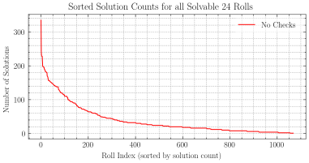
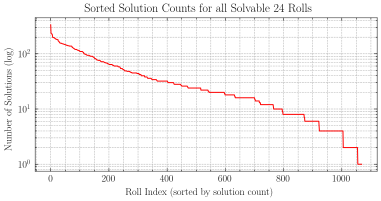
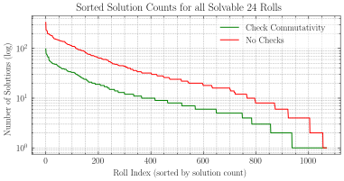
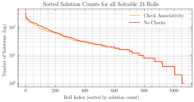
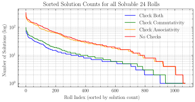

24 is a mental arithmetic racing game.
The idea is simple; you are presented with four numbers in the range 1--12 (henceforth a "roll"):
$$4, 8, 7, 8$$
Then, using the four basic operations (\\(+, -, \times, \div\\)), you must write an expression that evaluates to 24 using *all* the numbers provided in the roll.
Can you figure out the example above? &nbsp;&nbsp;&nbsp;&nbsp;&nbsp; *Solution:* {}\\( (4 - 8 + 7) \times 8 \\).{}

Coding a 24 game and playing it with friends are both entertaining pastimes, but the game presents some interesting challenges along the way.
First and foremost, we need a way to generate rolls.
The naïve approach is to randomly sample 4 numbers from a uniform distribution over the range 1--12, and then pray that the roll is solvable.
This works *okay*, but in practice, it is impossible to ascertain if a roll is unsolvable or simply difficult to find a solution for.
$$7, 7, 3, 3$$
It's fun to try for a while, but at what point do you stop and say there's probably no solution?

## Solvable Rolls

It is probably unsurprising that not all rolls are solvable.
You can convince yourself that, for example, the roll \\(1, 1, 1, 1\\) cannot reach 24 no matter how you construct expressions with it{}There are only 3 solvable rolls of the form \\(1, 1, 1, x\\). Can you find all 3?{}.
To be sure, we could check every possible expression using 4 numbers and 4 operations and verify that none of them evaluate to 24.
Is that tractable?

### Counting expressions

Suppose we have an arbitrary roll \\(a, b, c, d\\). How many possible expressions can be constructed using the 4 operations (\\(+, -, \times, \div\\))?

This, as with most combinatorial problems, is a more difficult endeavor than it lets on. We may consider all sequences of
$$\text{number}\quad\text{operation}\quad\text{number}\quad\text{operation}\quad\text{number}\quad\text{operation}\quad\text{number}$$
hoping to reach all expressions, but without adding parentheses, certain expressions like \\((a+b)\times(c+d)\\) are unreachable due to the strict grammar of the Order Of Operations™.
A better approach is to enforce full parenthesization---that is, one set of parentheses per operation. 
This way, the order of operations is enforced by construction rather than by the arbitrary grammar of PEMDAS{}For those unfamiliar, PEMDAS (or BIDMAS or whatever other acronym) is a mnemonic for remembering which operations take precedence with evaluating an expression: **p**arentheses, **e**xponents, **m**ultiplication, **d**ivision, **a**ddition, **s**ubtraction.{}.
However, simply adding parentheses is not so simple.
$$a \cdot b \cdot c \cdot d$$
Here \\(\cdot\\) represents an arbitrary operation. 
How many ways can we parenthesize this expression?

It turns out that this is a well-known combinatorial problem, and gives rise to one of the most important sequences in combinatorics. To understand why, consider the following parenthesization:
$$(a \cdot ((b \cdot c) \cdot d))$$
If we remove the outermost parentheses and collect the operands, we get two new parenthesized expressions.
$$a \qquad ((b \cdot c) \cdot d)$$
Note that the resulting two objects mimic the type of the original. This means we can recurse!
If we continue down the chain, adding a node for every new parenthesized expression and a leaf for every standalone number, we end up with a binary tree.

```goat {height="170"}
   .
  / \
 /   \
a     +
     / \
    /   \
   +     d
  / \
 /   \
b     c
```

The binary tree has 4 leaves (corresponding with the roll) and the shape of the tree was determined by our parenthesization. Now we have a new, but equivalent, counting question: How many binary trees exist with 4 leaf nodes?

Both of these problems are inherently binary{}The parenthesization problem is binary in the sense that our operations are binary operations, i.e. they take **two** operands.{} and recursive, and that is key. Imagine we are building up a binary tree with 4 leaves, and the current tree looks like this:

```goat {height="70"}
   .
  / \
 /   \
a     b
```

A binary tree with \\(k\\) leaves has \\(2k - 1\\) nodes in total. To construct a tree with one more leaf, we can choose any node to break off, insert a new node, and attach the existing subtree along with a new leaf. We have \\(2k - 1\\) nodes to choose from, along with a choice between left or right, which results in 6 choices in this case.

```goat {height="135"}
      o         o               .            .         .            .
     / \       / \             / \          / \       / \          / \
    /   \     /   \           /   \        /   \     /   \        /   \
   +   c o   o c   +         o     b      o     b   a     o      a     o
  / \             / \       / \          / \             / \          / \
 /   \           /   \     /   \        /   \           /   \        /   \
a     b         a     b   a   c o      o c   a         o c   b      b   c o
```

Upon completion, this step produces a new tree with \\(k + 1\\) leaves and \\(2k + 1\\) nodes.
We can continue this process until a binary tree of desired size is constructed.
Every sequence of choices constructs a unique binary tree, so counting the number of choices will yield our answer.
Starting with a 1-leaf tree, the process requires \\(n\\) steps to construct a binary tree with \\(n + 1\\) leaves.
Each step has \\(2\cdot(2k - 1)\\) choices, yielding the following{}A few subtle things to note in this derivation: (1) recall the definition of a [double factorial](https://en.wikipedia.org/wiki/Double_factorial) as \\(n!! = n\cdot(n - 2)\cdot(n - 4)\dots\\), and (2) we can decompose \\(n! = n!! \cdot (n - 1)!!\\).{}.
$$
\begin{aligned}
   T_n &= (2\cdot1)\cdot(2\cdot3)\cdot(2\cdot5)\cdots(2\cdot(2n - 1)) \\\\
   &= 2^n \cdot (2n - 1)!! \\\\
   &= 2^n \frac{(2n)!}{(2n)!!} \\\\
   &= \frac{(2n)!}{n!}
\end{aligned}
$$
Thus, we obtain the **quadruple factorial numbers**: 1, 2, 12, 120, 1680, ...{}[A001813](https://oeis.org/A001813) on OEIS.{}

If we only want the unique parenthesizations (i.e. we do not care about the order of the terms within the parentheses), we can divide by \\((n + 1)!\\) and obtain the **Catalan numbers**: 1, 1, 2, 5, 14, ...{}[A000108](https://oeis.org/A000108) on OEIS.{}

These sequences fell out of a binary recursive structure, so you may rightly posit that these are incredibly important sequences in math. Indeed, the Catalan numbers appear across a vast variety of problems, and it hosts one of the longest descriptions in the [Online Encyclopedia of Integer Sequences (OEIS)](https://oeis.org/). For those especially interested, the brilliant [SackVideo](https://www.youtube.com/@ASackVideo)'s ["The Most Important Sequence: The Catalan Numbers"](https://www.youtube.com/watch?v=TAuJV5eNKLM) is highly worth a watch!

Refocusing on 24, we can compute an *upper bound* for the number of expressions.
There are 5 unique parenthesizations of 4 numbers.
$$
\begin{aligned}
   (a \cdot (b \cdot (c \cdot d))) \\\\
   (a \cdot ((b \cdot c) \cdot d)) \\\\
   ((a \cdot b) \cdot (c \cdot d)) \\\\
   ((a \cdot (b \cdot c)) \cdot d) \\\\
   (((a \cdot b) \cdot c) \cdot d)
\end{aligned}
$$
Accounting for permutations of the numbers, we reach a maximum of \\(5\times24=120\\) parenthesized---but operation-less---expressions{}This is only true if the 4 numbers of the roll are distinct. In the case of repeated entries, we have to divide by the extent that we have overcounted. Since permuting across only repeated entries does not change the overall permutation, we divide by the factorial of the multiplicities of every repeated entry. Importantly, this is always **lower** than the *quadruple factorial number* we borrowed from above. (Remember, we are only after an *upper bound* here.){}. Choosing 3 operations (with replacement) out of \\(+, -, \times, \div\\) yields an upper bound of \\(5\times24\times4^3=7,860\\) expressions.

#### Foreshadowing

The astute among you may have noticed no mention of *commutativity* or *associativity*. The following expressions are treated as distinct,
$$
\begin{aligned}
   (3+(4+5)) \\\\
   ((4+5)+3) \\\\
   (4+(3+5)) \\\\
   ((3+4)+5)
\end{aligned}
$$
even though we can tell, at a glance, before evaluating anything, that they are equivalent. Two of our four operations, \\(+\\) and \\(\times\\), have special properties that allow us to draw such "equivalences."

- \\(\cdot\\) is **commutative** if \\(a \cdot b = b \cdot a\\)
- \\(\cdot\\) is **associative** if \\(a \cdot (b \cdot c) = (a \cdot b) \cdot c\\)

Both \\(+\\) and \\(\times\\) are commutative *and* associative. For a sequence of operands connected by only \\(+\\) or only \\(\times\\), we can re-parenthesize and permute the operands without changing the expression's value. We have overcounted!

But that's okay. We were after an *upper bound*, and that is what we obtained above. We will explore how commutativity and associativity affect the solutions of 24 later on.

### Finding All Solvable Rolls

How many possible rolls are there?

As a naïve upper bound, we can take 4 choices in the range 1--12 to get \\(12^4=20,736\\).
Combined with the previous result, we need to compute up to 162,984,960 expressions to fully solve 24.
That is actually... not awful?

But we can do slightly better.
The naïve calculation overcounts by a lot, since it does not account for permutations (i.e. \\(1, 2, 3, 4\\) and \\(4, 3, 2, 1\\) are the same roll).
The question of how many unique rolls exist (up to permutation) turns out to be quite interesting.

Let's start with an easy case, where all the numbers must be distinct.
*From a bag of 12 balls, how many ways can we pick 4?*
We have 1 less option for every subsequent choice, and to account for re-ordering we divide by the number of permutations.
This is known as the **binomial coefficient**{}The binomial coefficient is named so because \\(\binom{n}{k}\\) is the coefficient generated by the \\(k^{\text{th}}\\) term of the expression \\((a + b)^n\\), a *bi-nomial (two terms)* power!{}.
$$\frac{12\cdot11\cdot10\cdot9}{4\cdot3\cdot2\cdot1} = \frac{12!}{4!\cdot8!} = \binom{12}{4}$$
In general, we can pick \\(n\\) objects from a selection pool of size \\(d\\),
$$\binom{d}{n} = \frac{d!}{n!\cdot(n - d)!}$$
For 24, we get 495 rolls with distinct elements. Now to count the rest!

How do we manage duplicates?

#### Creating a Blueprint

Thinking about duplicates directly is a little difficult
Instead, consider how many distinct elements are rolled overall.
Since the order of elements in a roll does not matter, we can sort a roll in increasing order without losing generality.
Grouping duplicates uncovers a blueprint of all possibilities for a roll.
$$
\def\s{\\ \\,\\ }
\def\sep{\\ |\\ }
\begin{gather}
   a \sep b \sep c \sep d \\\\
   \\\\
   a \sep b \sep c \s c \\\\
   a \sep b \s b \sep c \\\\
   a \s a \sep b \sep c \\\\
   \\\\
   a \sep b \s b \s b \\\\
   a \s a \sep b \s b \\\\
   a \s a \s a \sep b \\\\
   \\\\
   a \s a \s a \s a
\end{gather}
$$
4 numbers produce 8 possible groupings, which can then be categorized by the number of distinct elements (a \\(k\\)-grouping with \\(k\\) distinct elements).
In all cases, the number of groups in a grouping is 1 greater than the number of separator bars (\\(|\\)).
In fact, we can count how many \\(k\\)-groupings exist by counting the possible placements of \\(k - 1\\) separator bars.
There are \\(n - 1\\) slots (between the \\(n\\) numbers rolled), yielding a total number of groupings of
$$\sum_{k=1}^{n}\binom{n - 1}{k - 1}=\binom{n-1}{0} + \binom{n-1}{1} + \dots + \binom{n-1}{n - 2} + \binom{n-1}{n - 1}$$
This is, in fact, summing a row of Pascal's triangle.
The arguments of the binomial coefficient, \\(n\\) and \\(k\\), index the rows and columns of Pascal's triangle (i.e. \\(\binom{n}{k}\\) is the \\(n^{\text{th}}\\) row, \\(k^{\text{th}}\\) entry, using 0-indexing).
$$
\begin{gather}
   1 \\\\
   1 \quad 1 \\\\
   1 \quad 2 \quad 1 \\\\
   1 \quad 3 \quad 3 \quad 1 \\\\
   1 \quad 4 \quad 6 \quad 4 \quad 1
\end{gather}
$$
An alternate, popular construction of Pascal's triangle is to fill cells by adding the two entries above it.
By this construction, every row subsequent row must double its sum (since every number is added precisely twice).
The top (\\(0^{\text{th}}\\)) row starts at 1, so the \\(n^{\text{th}}\\) row must sum to \\(2^n\\).
$$\sum_{k=1}^{n}\binom{n - 1}{k - 1}=\binom{n-1}{n-1} + \binom{n-1}{n-2} + \dots + \binom{n-1}{1} + \binom{n-1}{0} = 2^{n - 1}$$

#### Counting Rolls

As shown above, there are \\(\binom{n - 1}{k - 1}\\) possible \\(k\\)-groupings.
To populate a grouping with numbers, we can choose \\(k\\) distinct numbers out of our \\(d\\) choices (our choices must be distinct, since we are accounting for duplicates separately in this calculation), which is given by \\(\binom{d}{k}\\).
The total number of rolls is therefore a sum of products. 
$$\binom{n-1}{n-1}\binom{d}{1} + \binom{n-1}{n-2}\binom{d}{2} + \dots + \binom{n-1}{1}\binom{d}{n - 1} + \binom{n-1}{0}\binom{d}{n}$$
This is, rather incredibly, an instance of [Vandermonde's identity](https://en.wikipedia.org/wiki/Vandermonde's_identity),
$$\sum _{k=0}^{r}{m \choose k}{n \choose r-k}={m+n \choose r}$$
which means our final expression collapses into a single binomial coefficient.
$$\binom{n + d - 1}{n}$$
Isn't that amazing? Roll \\(n\\) dice of \\(d\\) faces and the number of unique rolls you can get is, somehow, the combinations of \\(n\\) objects from \\(n + d - 1\\) objects.

Let's look at a couple sequences that arise with various \\(d\\):
- \\(d=1\\) &rarr; 1, 1, 1, 1, 1, ...{}[A000012](https://oeis.org/A000012) on OEIS.{}
- \\(d=2\\) &rarr; 1, 2, 3, 4, 5, ... (natural numbers){}[A000027](https://oeis.org/A000027) on OEIS.{}
- \\(d=3\\) &rarr; 1, 3, 6, 10, 15, ... (triangular numbers){}[A000217](https://oeis.org/A000217) on OEIS.{}
- \\(d=4\\) &rarr; 1, 4, 10, 20, 35, ... (tetrahedral numbers){}[A000292](https://oeis.org/A000292) on OEIS.{}
- \\(d=5\\) &rarr; 1, 5, 15, 35, 70, ... (pentanope numbers){}[A000332](https://oeis.org/A000332) on OEIS.{}

Even more amazingly, our choice of \\(d\\) generates the \\(d^{\text{th}}\\) diagonal of Pascal's triangle, where increasing \\(n\\) descends the diagonal!
$$
\begin{gather}
   1 \\\\
   1 \quad 1 \\\\
   1 \quad 2 \quad 1 \\\\
   1 \quad 3 \quad 3 \quad 1 \\\\
   1 \quad 4 \quad 6 \quad 4 \quad 1 \\\\
   1 \quad 5 \quad 10 \quad 10 \quad 5 \quad 1 \\\\
   1 \quad 6 \quad 15 \quad 20 \quad 15 \quad 6 \quad 1 \\\\
   1 \quad 7 \quad 21 \quad 35 \quad 35 \quad 21 \quad 7 \quad 1 \\\\
   1 \quad 8 \quad 28 \quad 56 \quad 70 \quad 56 \quad 28 \quad 8 \quad 1
\end{gather}
$$

Pascal's triangle is intricately infested with interesting properties. I would recommend [zhuli](https://www.youtube.com/@zhulimath)'s video ["The Dark Side of Pascal's Triangle"](https://www.youtube.com/watch?v=rQzu5JUjaG0) to see even more---another worthwhile watch!

#### Checking Solvability

Plugging in the case of 24, we want 4<sup>th</sup> entry of the 12<sup>th</sup> diagonal of Pascal's triangle. Thus we obtain 1,365 unique rolls, or up to 10,728,900 expressions to check. That's super doable!

*Crunching numbers...*{}In practice, much less than 10 million expressions are needed. If we find a valid expression for a given roll, we can skip all the remaining unchecked expressions since we know the roll is solvable.{}

Out of our 1,365 rolls, a total of **1,069** are solvable!
Finally, instead of praying that random numbers are solvable, we can instead uniformly sample from all precomputed *solvable* rolls.
A list of solvable rolls is available [here](solvable.txt).

## Counting Solutions

Solving 24 is so tractable that we can have some extra fun with it.
Instead of checking for solvability alone, we can count *how many* distinct solutions a solvable roll has.
After all, 10,728,900 expressions should only take a few seconds to churn through.

*Crunching numbers...*
```
1, 4, 8, 12: 335 solutions
1, 2, 3, 4: 242 solutions
1, 5, 7, 12: 230 solutions
1, 1, 2, 12: 229 solutions
1, 1, 3, 8: 228 solutions
...
```

\\(1, 4, 8, 12\\) is the "easiest" roll, at least in terms of having the most solutions.
On the other end of the spectrum, we can look for the most "difficult" rolls, i.e. those with the fewest solutions.
There's exactly 14 rolls with exactly 1 solution. Give them a try!

- \\(1, 2, 7, 7\\) &nbsp;&nbsp;&nbsp;&nbsp;&nbsp; *Solution:* {}\\( (7 \times 7 - 1) \div 2 \\){}
- \\(1, 3, 4, 6\\) &nbsp;&nbsp;&nbsp;&nbsp;&nbsp; *Solution:* {}\\( 6 \div (1 - 3 \div 4) \\){}
- \\(1, 5, 11, 11\\) &nbsp;&nbsp;&nbsp;&nbsp;&nbsp; *Solution:* {}\\( (11 \times 11 - 1) \div 5 \\){}
- \\(1, 6, 6, 8\\) &nbsp;&nbsp;&nbsp;&nbsp;&nbsp; *Solution:* {}\\( 6 \div (1 - 6 \div 8) \\){}
- \\(1, 8, 12, 12\\) &nbsp;&nbsp;&nbsp;&nbsp;&nbsp; *Solution:* {}\\( 12 \div (12 \div 8 - 1) \\){}
- \\(2, 3, 5, 12\\) &nbsp;&nbsp;&nbsp;&nbsp;&nbsp; *Solution:* {}\\( 12 \div (3 - 5 \div 2) \\){}
- \\(3, 3, 5, 5\\) &nbsp;&nbsp;&nbsp;&nbsp;&nbsp; *Solution:* {}\\( 5 \times 5 - 3 \div 3 \\){}
- \\(3, 3, 8, 8\\) &nbsp;&nbsp;&nbsp;&nbsp;&nbsp; *Solution:* {}\\( 8 \div (3 - 8 \div 3) \\){}
- \\(4, 4, 10, 10\\) &nbsp;&nbsp;&nbsp;&nbsp;&nbsp; *Solution:* {}\\( (10 \times 10 - 4) \div 4 \\){}
- \\(5, 5, 5, 5\\) &nbsp;&nbsp;&nbsp;&nbsp;&nbsp; *Solution:* {}\\( 5 \times 5 - 5 \div 5 \\){}
- \\(5, 5, 8, 8\\) &nbsp;&nbsp;&nbsp;&nbsp;&nbsp; *Solution:* {}\\( 5 \times 5 - 8 \div 8 \\){}
- \\(5, 5, 9, 9\\) &nbsp;&nbsp;&nbsp;&nbsp;&nbsp; *Solution:* {}\\( 5 \times 5 - 9 \div 9 \\){}
- \\(5, 5, 10, 10\\) &nbsp;&nbsp;&nbsp;&nbsp;&nbsp; *Solution:* {}\\( 5 \times 5 - 10 \div 10 \\){}
- \\(5, 5, 11, 11\\) &nbsp;&nbsp;&nbsp;&nbsp;&nbsp; *Solution:* {}\\( 5 \times 5 - 11 \div 11 \\){}

Solving this particular subset of rolls is quite interesting because commutativity and associativity have not been accounted for.
Solutions cannot include a sub-expressions like \\(1 \times 2\\), since replacement with \\(2 \times 1\\) would make a distinct, yet equivalent, solution.

The overall distribution of solution counts drops off rapidly after the initial solution-rich rolls.

The behavior is a bit difficult to characterize beyond that, though perhaps it is a bit easier in log space.

Hereafter, we will stick to log space when looking at these plots.

Taking a closer look at the solutions of \\(1, 4, 8, 12\\), ignoring commutativity and associativity leaves this result a little unsatisfying.
$$
\begin{gather}
   (1 \times ((8 \div 4) \times 12)) \\\\
   ((1 \times (8 \div 4)) \times 12) \\\\
   (1 \times (12 \times (8 \div 4))) \\\\
   ((1 \times 12) \times (8 \div 4)) \\\\
   \dots
\end{gather}
$$
It's about time we see how accounting for our special properties of \\(+\\) and \\(\times\\) affects the solutions of 24.

### Accounting for Commutativity Only

Re-running our calculations, we get a slightly altered leaderboard
```
1, 4, 8, 12: 98 solutions
1, 2, 4, 12: 81 solutions
1, 1, 2, 12: 77 solutions
1, 1, 3, 8: 76 solutions
1, 1, 4, 6: 76 solutions
...
```
but a pretty big impact on the overall distribution.

It looks like the distribution has shifted down, kind of? It's difficult to make any precise statements about the distribution from this graph alone since the order of rolls has changed. The maximum-solution-roll remains as \\(1, 4, 8, 12\\), but the set of single-solution-rolls has dramatically increased to 132. 118 of these were 1 commutative operation away from a single solution before!

### Accounting for Associativity Only

Cases where associativity can meaningfully reduce the solution count is much rarer than for commutativity, since it requires the same operation chained at least twice. For this reason, our solution count remains high with much lower alterations from the start than before.
```
1, 4, 8, 12: 287 solutions
1, 2, 3, 4: 218 solutions
1, 1, 2, 12: 205 solutions
1, 1, 3, 8: 204 solutions
1, 1, 4, 6: 204 solutions
...
```
The affect on the distribution is less dramatic,

but we can notice a "staggering" added to the staircase of low-solution rolls. Of course, this was the case for the commutativity as well, but by correcting the counts for commutativity and associativity, odd solution counts are now much easier to reach. There is also a tiny sliver for the single-solution cases; we have 1 new interesting case to look at!

- \\(3, 3, 3, 3\\) &nbsp;&nbsp;&nbsp;&nbsp;&nbsp; *Solution:* {}\\( 3 \times 3 \times 3 - 3 \\){}

For this case, we can use our commutative operations because all the operands are the same; permuting them does not create a distinct expression.

### Accounting for Both!

Accounting for both gives us our final leaderboard,
```
1, 4, 8, 12: 74 solutions
1, 2, 4, 12: 71 solutions
1, 3, 6, 12: 65 solutions
1, 2, 6, 8: 62 solutions
1, 1, 2, 12: 61 solutions
...
```
with \\(1, 4, 8, 12\\) standing strong as the maximum-solution roll across the board! There are now a staggering 168 single-solution rolls, many of which are really quite easy. The following rolls all have 1 solution up to commutativity and associativity,
- \\(1, 1, 11, 11\\) &nbsp;&nbsp;&nbsp;&nbsp;&nbsp; *Solution:* {}\\( 1+1+11+11 \\){}
- \\(1, 7, 7, 9\\) &nbsp;&nbsp;&nbsp;&nbsp;&nbsp; *Solution:* {}\\( 1+7+7+9 \\){}
- \\(4, 5, 6, 9\\) &nbsp;&nbsp;&nbsp;&nbsp;&nbsp; *Solution:* {}\\( 4+5+6+9 \\){}

and they may not seem so easy, until you see the one simple trick to solving all of them. The final distributions are as follows.


Believe it or not, there is more to explore here. Although \\(-\\) and \\(\div\\) are neither commutative nor associative, they do exhibit other properties that we could try to account for.
$$
\begin{gather}
a - (b - c) = c - (b - a) \\\\
a \div (b \div c) = c \div (b \div a)
\end{gather}
$$
These, however, are out of the scope of this blog post. We have covered more than enough ground for today!

## Final Remarks

If you have been attempting to solve some of the challenging rolls in this blog post so far, you may have noticed that some of your solutions use non-integer values at intermediate steps.

As a final search for challenging rolls, I decided to look at solutions which *require* non-integer values at intermediate steps in order to reach 24. As one last challenge, here are the 15 rolls with this property!

- \\(1, 3, 4, 6\\) &nbsp;&nbsp;&nbsp;&nbsp;&nbsp; *Solution:* {}\\( 6 \div (1 - 3 \div 4) \\), shown above.{}
- \\(1, 4, 5, 6\\) &nbsp;&nbsp;&nbsp;&nbsp;&nbsp; *Solution:* {}\\( 4 \div (1 - 5 \div 6) \\) or \\( 6 \div (5 \div 4 - 1) \\){}
- \\(1, 5, 5, 5\\) &nbsp;&nbsp;&nbsp;&nbsp;&nbsp; *Solution:* {}\\( 5 \times (5 - 1 \div 5) \\){}
- \\(1, 6, 6, 8\\) &nbsp;&nbsp;&nbsp;&nbsp;&nbsp; *Solution:* {}\\( 6 \div (1 - 6 \div 8) \\), shown above.{}
- \\(1, 8, 12, 12\\) &nbsp;&nbsp;&nbsp;&nbsp;&nbsp; *Solution:* {}\\( 12 \div (12 \div 8 - 1) \\), shown above.{}
- \\(2, 2, 11, 11\\) &nbsp;&nbsp;&nbsp;&nbsp;&nbsp; *Solution:* {}\\( 11 \times (2 + 2 \div 11) \\).{}
- \\(2, 3, 5, 12\\) &nbsp;&nbsp;&nbsp;&nbsp;&nbsp; *Solution:* {}\\( 12 \div (3 - 5 \div 2) \\), shown above.{}
- \\(2, 4, 10, 10\\) &nbsp;&nbsp;&nbsp;&nbsp;&nbsp; *Solution:* {}\\( 10 \times (2 + 4 \div 10) \\).{}
- \\(2, 5, 5, 10\\) &nbsp;&nbsp;&nbsp;&nbsp;&nbsp; *Solution:* {}\\( 5 \times (5 - 2 \div 10) \\){}
- \\(2, 7, 7, 10\\) &nbsp;&nbsp;&nbsp;&nbsp;&nbsp; *Solution:* {}\\( 7 \times (2 + 10 \div 7) \\).{}
- \\(3, 3, 7, 7\\) &nbsp;&nbsp;&nbsp;&nbsp;&nbsp; *Solution:* {}\\( 7 \times (3 + 3 \div 7) \\), asked at the beginning!{}
- \\(3, 3, 8, 8\\) &nbsp;&nbsp;&nbsp;&nbsp;&nbsp; *Solution:* {}\\( 8 \div (3 - 8 \div 3) \\), shown above.{}
- \\(4, 4, 7, 7\\) &nbsp;&nbsp;&nbsp;&nbsp;&nbsp; *Solution:* {}\\( 7 \times (4 - 4 \div 7) \\).{}
- \\(5, 5, 7, 11\\) &nbsp;&nbsp;&nbsp;&nbsp;&nbsp; *Solution:* {}\\( 5 \times (7 - 11 \div 5) \\).{}
- \\(5, 7, 7, 11\\) &nbsp;&nbsp;&nbsp;&nbsp;&nbsp; *Solution:* {}\\( 7 \times (5 - 11 \div 7) \\).{}


