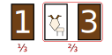

---
format:
  hugo-md:
    code-fold: false
parent: null
title: Unpacking Monty Hall
deck: Understanding the Monty Hall problem from a programmatic perspective.
date: '2025-10-17T01:25:44+02:00'
tags: []
execute:
  echo: true
jupyter: python3
---


The Monty Hall problem has been a staple of popular math media for decades, and unsurprisingly so.
It presents a simple setup, with almost universally familiar mathematics, and wields a playfully unintuitive solution.

Run-of-the-mill explainers tend to present one or a combination of a few standard explanations that popular math outlets have converged upon.
These explanations are, in a way, survivors of a natural selection process; they are memetically optimized to be the simplest, most intuiitive explanations.
However, simplicity carries a lurking danger.
Mathematics, in a culture-wide game of Chinese whispers, undergoes a degradation in precision and rigor---an accretion of *ambiguity*.

One of the best antidotes to ambiguity is computation.
With a computer, there is no room for ambiguity---a computer will do as it is told, which means you must say it exactly as you mean it.
If your understanding contains artefacts of memetic mutation, they candidly manifest as roadblocks in the program transcription process.

In my opinion, one of the most common explanations for the Monty Hall problem, almost as ubiquitous as the problem itself, carries forward an intuition that fails to generalize. To see why, let's visit the classic Monty Hall problem, walk through the insidious explanation, and tackle the root of the problem with programming.

## Three Doors and a Gameshow Host

You are invited as a contestant to a gameshow. Before you stand three large doors, and a gameshow host.


> "One door holds a brand new car, and the other two goats.
> You must try to win the grand prize.
> It's a game of luck! What door would you like to pick?"

> "I'll pick door 1."

> "Aha! Let's wait a moment.
> I know what's behind the doors, and I want to show you that door 2 has a goat behind it.
> This means the car is either behind door 1 or door 3.
> Do you want to stick with your original choice or switch?"


#### Well, do you switch?

If you have never encountered this problem before, take a minute to decide if switching is favorable.


<br>
<br>
<br>

When first faced with this problem, the overwhelming first instinct is that switching makes no difference.
Now that the second door is out of the question, the problem reduces to one with 2 doors.
The probabilities split evenly across the doors, resulting in a winning probability of 1/2 for both choices.
Thus, in practice, most people will stick with their original choice.

It turns out that switching *is favorable*, and has a winning probability of 2/3.

### The Insidious Explanation

There are many valid explanations for this result, but the one I take issue with goes as follows:

> In the beginning, all doors start with a 1/3 chance of holding the prize.
> 
> Upon selecting door 1, you can combine the remaining doors into one group with a 2/3 chance of holding the prize.
> 
> When the host reveals a goat behind door 2, these "grouped" probabilities don't change.
> 
> This means your door remains at a 1/3 chance, while the remaining two doors (of which only one remains to switch to) remains at a 2/3 chance.
> Thus, there is a winning probability of 2/3 if you switch.

Every statement above is *correct*, of course, and the final probability of 2/3 is true.
This "grouping" argument is quite popular because it is easy to generalize the argument to 1000 doors.
After selection, the host reveals 998 goats, and asks if you want to switch.
What's more likely---you picking the car at the start, or the host revealing all remaining doors without the car?

Nonetheless, I think the visual representation above can be a little misleading.
To see why, consider a similar problem with playing cards.

## Three Cards and a Gust of Wind

You are playing with three cards from a deck: two jokers and the ace of hearts.
You shuffle the cards and lay them face down in front of you.


> "*Okay, I'm gonna try to pick the ace of hearts.
> I'll pick the first card.*"

As you reach down for the first card, a gust of wind blows over your deck and flips cards at random.
The second card in front of you flips to reveal a joker.

> "*Shoot. I can't undo that now.
> At least I still don't know what's under the third card.
> I wonder if switching to the third card makes it more likely to land on the ace of hearts?*"


#### Well, do you switch?

As before, take a minute to decide if switching is favorable.


<br>
<br>
<br>

As before, our first instinct may be that switching makes no difference.
However, the Monty Hall problem warns us against blindly trusting our first instinct.
We may, instead, consider the parallels between this card game and the classic Monty Hall problem.
Applying the same "grouping" argument, we could conclude that switching yields a probability of 2/3.

I have, of course, chosen this variant on purpose.
As I have been alluding to, this argument does not work here.
Switching cards makes indeed no difference; the probabilities indeed collapse to 1/2--1/2.
*What?*

What is different in the Monty Hall problem? The fact that the gameshow host has sentience?

## Three Numbers and a Random Number Generator

To really understand what is going on here, let's try specifying this scenario using code.
We will use Python and its standard library module **`random`**.
The `random` module contains two functions that will be particularly useful for this exercise:

-   The `randint(a, b)` function returns a uniformly random integer between `a` and `b` (inclusive).
-   The `choice([a1, a2, ..., an])` function returns a uniformly random choice across the list items `a1`, `a2`, ..., `an`.

``` python
from random import randint, choice
```

### Monty Hall: The Classic Variant

Let us imagine the 3 doors from the Monty Hall problem, labelled 1--3.
The prize would have been placed behind one of these doors randomly.

``` python
prize = randint(1, 3)
```

The contestant then selects a door.
Although human psychology complicates this selection, let's make the simplifying assumption that this distribution is also uniform.

``` python
selection = randint(1, 3)
```

Now, the host has to reveal a random door that has a goat behind it.
This is not so simple, since there are doors the host *cannot* reveal.
How does the host complete this step?

This is the crux of the unintuitive nature of the problem.
We have to think through exactly what the host must do.
The host cannot reveal the contestant's selection, but if the prize is left in the remaining doors, we cannot reveal that door either.
We have to account for both of these restrictions in our code, and only then can we choose to reveal a door from the remaining options.

``` python
reveal_options = [1, 2, 3]

reveal_options.remove(selection)

if prize in reveal_options:
    reveal_options.remove(prize)

reveal = choice(reveal_options)
```

Note that we have two possible removals from the `reveal_options` list. If our selection is different from the prize (which occurs 2/3 of the time), then the host's reveal is forced to one door. In these cases, the non-selected door must contain the car. *Interesting!*

As a final step, we can switch our selection to the remaining door using a similar strategy.
In this case, no checks are needed since the selection and reveal are guaranteed to be different.

``` python
switching_options = [1, 2, 3]

switching_options.remove(reveal)
switching_options.remove(selection)

new_selection = switching_options[0]  # only 1 item left
```

The code written so far can be combined into a single function; one *trial* of the Monty Hall problem.
This function will gauge the success of the **switching** strategy, returning `True` if the prize was won and `False` otherwise.

``` python
def classic_monty_hall():
    # setup
    prize = randint(1, 3)
    selection = randint(1, 3)

    # reveal
    reveal_options = [1, 2, 3]
    reveal_options.remove(selection)
    if prize in reveal_options:
        reveal_options.remove(prize)
    reveal = choice(reveal_options)

    # switch
    switching_options = [1, 2, 3]
    switching_options.remove(reveal)
    switching_options.remove(selection)
    new_selection = switching_options[0]  # only 1 item left

    return new_selection == prize
```

Now we can run as many trials of a classic Monty Hall game as we want.
If we run 1 million trials, we can see that the probability indeed converges to ~2/3.

``` python
trials = 1_000_000
wins = 0
for i in range(trials):
    if classic_monty_hall():
        wins += 1
print(f'Classic Monty Hall: {wins}/{trials} ~ {wins/trials}')
```

    Classic Monty Hall: 667348/1000000 ~ 0.667348

Voilà!
So... what happened with the game of cards then?

### Monty Hall: The Stalin Variant

The card game has one subtle difference: the gust of wind could have flipped over *any* of the cards.
When the joker is revealed, there are certain possibilities we must outright reject in the probability calculation.
Henceforth, this will be referred to as the 'Stalin' variant.{}The use of 'Stalin' here is analogous to its use in 'Stalin sort'. Stalin sort is a (joke) sorting algorithm where out-of-order elements are discarded instead of being sorted into place. Here, trials are discarded when the relevant criteria fail.{}

To reflect this difference, we have to modify the "reveal" step in the code above.
This time, a random choice is made immediately.
If this choice contradicts the situation (flipping our selection or the ace of hearts), we then discard the entire trial.

``` python
reveal_options = [1, 2, 3]

reveal = choice(reveal_options)

if reveal == prize or reveal == selection:
    # we have to reject this trial here
    pass
```

To signify "rejection" in our trial function, we can return `None` (instead of a `True` or `False`).

``` python
def stalin_monty_hall():
    # setup
    prize = randint(1, 3)
    selection = randint(1, 3)

    # reveal
    reveal_options = [1, 2, 3]
    reveal = choice(reveal_options)
    if reveal == prize or reveal == selection:
        return None

    # switch
    switching_options = [1, 2, 3]
    switching_options.remove(reveal)
    switching_options.remove(selection)
    new_selection = switching_options[0]  # only 1 item left

    return new_selection == prize
```

As before, we can run 1 million trials, but we have to account for rejected trials in our tally. To do this, we need a new counter for successful trials, and skip incrementing if the trial is to be rejected.

``` python
trials = 1_000_000
total = 0
wins = 0
for i in range(trials):
    result = stalin_monty_hall()
    if result is None:
        continue  # skip rejected trials

    total += 1
    if result:
        wins += 1
print(f'Stalin Monty Hall: {wins}/{total} ~ {wins/total}')
```

    Stalin Monty Hall: 221683/443527 ~ 0.49981850033932546

After that one change, our probability now converges to 1/2. Isn't that cool?

To be thorough, we can also check the variant where our selection cannot be flipped (for example, our finger is placed on the card before the gust of wind arrives)---a 'semi-Stalin' variant.
In this case, our selection would be removed from the reveal options before making a random choice.

``` python
def semi_stalin_monty_hall():
    # setup
    prize = randint(1, 3)
    selection = randint(1, 3)

    reveal_options = [1, 2, 3]
    reveal_options.remove(selection)
    reveal = choice(reveal_options)
    if reveal == prize:
        return None

    switching_options = [1, 2, 3]
    switching_options.remove(reveal)
    switching_options.remove(selection)
    new_selection = switching_options[0]  # only 1 item left

    return new_selection == prize

trials = 1_000_000
total = 0
wins = 0
for i in range(trials):
    result = semi_stalin_monty_hall()
    if result is None:
        continue  # skip rejected trials

    total += 1
    if result:
        wins += 1
print(f'Semi-Stalin Monty Hall: {wins}/{total} ~ {wins/total}')
```

    Semi-Stalin Monty Hall: 333998/667092 ~ 0.5006775677117998

It turns out that both Stalin variants have the same final probability. Neat!

But... wait.
Something striking is going on with the semi-Stalin variant of the problem.
Notice how about 2/3 of the trials are successful, and 1/3 result in a win?
The wins, losses, and rejected trials split neatly into thirds!


It seems that exactly half of our wins in the classic variant are getting rejected in the semi-Stalin variant, leading to the reduction of wins from 2/3 to 1/2.
Why is this happening?

## Digging deeper

Evidently, our natural instincts about probability aren't *completely* wrong, and that is reflected in the Stalin variants of the problem.
We can intuit probabilities splitting evenly across the 3 cards, and then splitting evenly across the 2 cards.
However, the way these probabilities shift with new information is worth taking a closer look at.

Let's label the three selection options as "Prize," "Dud 1," and "Dud 2." The semi-Stalin variant starts with a random selection of the 3 options. The reveal then has 2 options out of the remaining cards. This leaves 6 possibilities, all of equal probability.


A dud is revealed, so the 2 possibilities that reveal a prize must be ruled out (as they contradict the scenario).
Since the duds are indistinguishable, the 4 remaining possibilities contribute to the final probability.
This neatly folds into the 1/2 probability that we expect with 2 cards.
Contrast this to the classic variant, where the host *must* reveal a dud in all scenarios.

Recall that if we select a dud, we force the host's reveal into one option.
By requiring that all scenarios contribute, and forcing the host's hand, the rejected outcomes are now transformed into wins.


*This* is the heart of the Monty Hall problem.
The solution is unintuitive, not because probability is unintuitive, but because the *problem statement* is unintuitive.

Looking back, we can now understand why the "grouping" argument works in the first place.
It is only by preserving all cases and forcing the host's hand that the grouped probabilities don't change.

For completeness, the Stalin and semi-Stalin variants are very similar---instead of two branches, the second layer will have 3 branches for a total of 9 possibilities.
These new branches account for the case that the *selection* is revealed, so all of them are rejected.
This reduces to the same 4 possibilities as in the semi-Stalin variant, but rejections take up 5/9 cases.

## Three Paragraphs and a Code

So, is probability the elusive monster that the Monty Hall makes it out to be?
It can be sometimes.
But it is also surmountable with precision, and we need not forego our intuition to do so.
Intuition is a powerful tool, and with the right guidance it can uncover sense in seemingly nonsensical truths.

The Monty Hall problem is no exception.
Despite its apparent simplicity, I hope to have shown it is anything but.
You can never know a concept *too* well, after all.
Nonetheless, I hope to have also demonstrated the joy in embarking on explorations assisted by our silicon friends.
In having no room for ambiguity, they force *us* to wrangle sense and precision out of what would once confuse us.
*That is, until they gain sentience, I suppose...*

As a final note, I have left a more condensed version of the code snippets below for the savvier Pythonistas among you.
Feel free to experiment with it on your own---go crazy!

``` python
def run_experiment(func, trials = 1_000_000):
    results = [q for _ in range(trials) if (q := func()) is not None]
    wins = sum(results)
    total = len(results)
    print(f"{func.__name__}: {wins}/{total} ~ {wins/total}")
    return func

@run_experiment
def classic_monty_hall():
    prize = randint(1, 3)
    selection = randint(1, 3)
    reveal = choice(list({1, 2, 3} - {selection, prize}))

    selection, = {1, 2, 3} - {reveal, selection}
    return selection == prize

@run_experiment
def semi_stalin_monty_hall():
    prize = randint(1, 3)
    selection = randint(1, 3)
    reveal = choice(list({1, 2, 3} - {selection}))
    if reveal == prize:
        return

    selection, = {1, 2, 3} - {reveal, selection}
    return selection == prize

@run_experiment
def stalin_monty_hall():
    prize = randint(1, 3)
    selection = randint(1, 3)
    reveal = choice([1, 2, 3])
    if reveal == prize or reveal == selection:
        return

    selection, = {1, 2, 3} - {reveal, selection}
    return selection == prize
```

    classic_monty_hall: 666390/1000000 ~ 0.66639
    semi_stalin_monty_hall: 333436/666818 ~ 0.5000404908085865
    stalin_monty_hall: 221722/443951 ~ 0.49942899103729915
